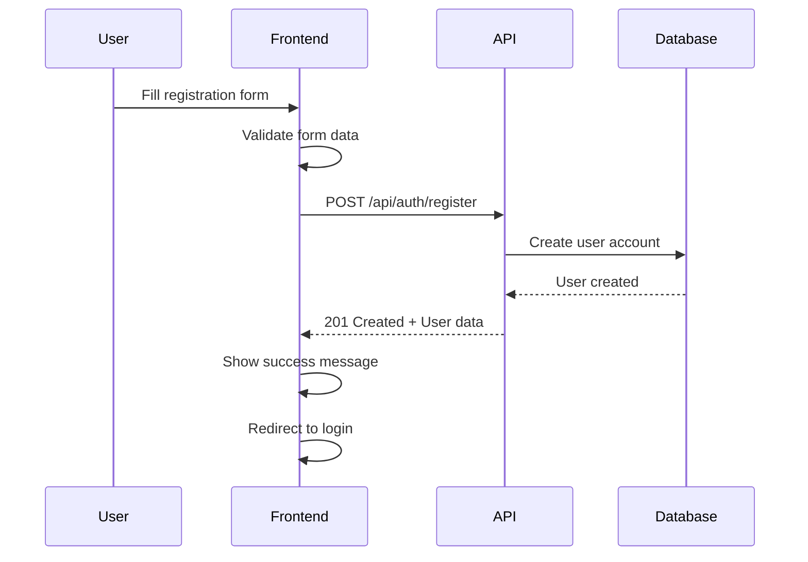
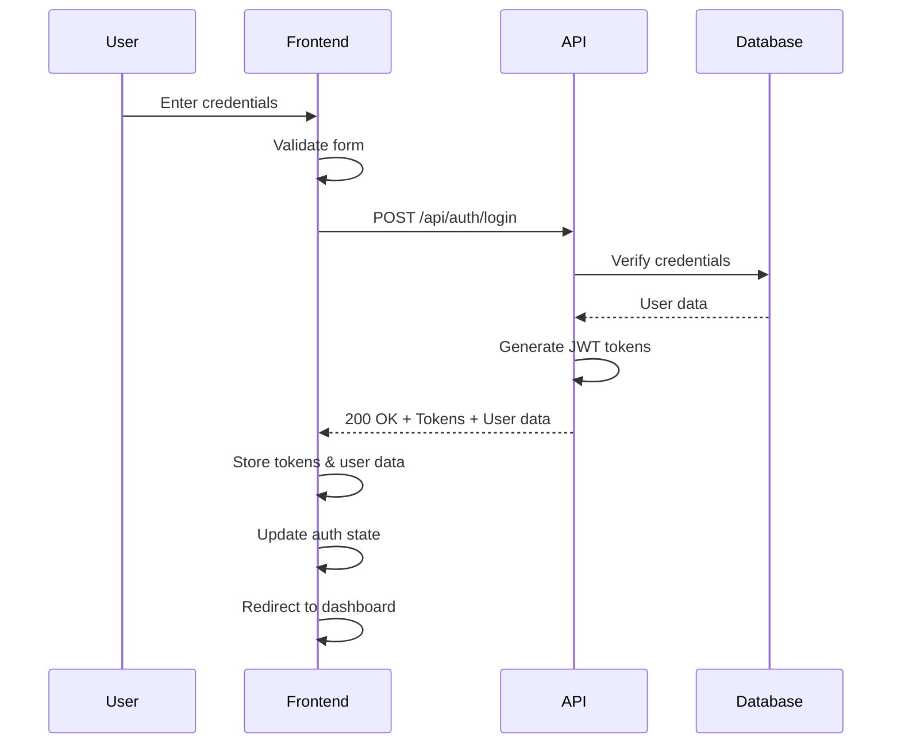
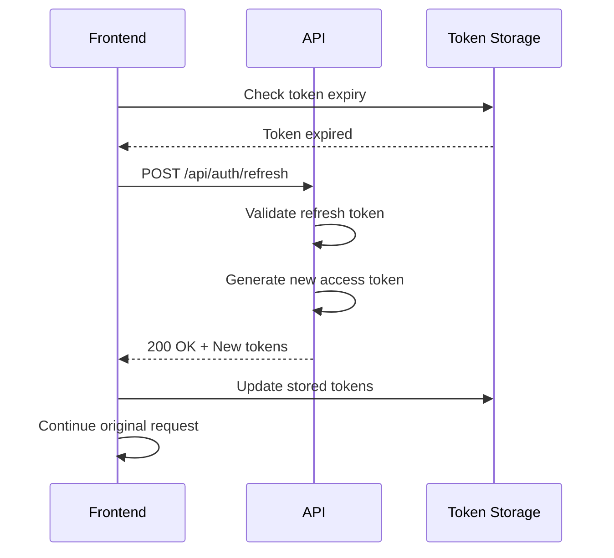
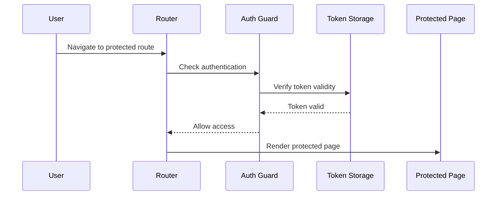

# LexiK3 Frontend Authentication Flow

## 📋 Table of Contents

- [Authentication Overview](#authentication-overview)
- [JWT Token Management](#jwt-token-management)
- [Authentication Flow Diagrams](#authentication-flow-diagrams)
- [Implementation Guide](#implementation-guide)
- [Security Considerations](#security-considerations)
- [Error Handling](#error-handling)
- [Token Refresh Strategy](#token-refresh-strategy)
- [Logout and Cleanup](#logout-and-cleanup)

## 🔐 Authentication Overview

LexiK3 uses JWT (JSON Web Token) based authentication with refresh tokens for secure, stateless user sessions. The frontend is responsible for managing token storage, automatic refresh, and handling authentication state.

### Key Components
- **Access Token**: Short-lived token (60 minutes) for API requests
- **Refresh Token**: Long-lived token (7 days) for obtaining new access tokens
- **Token Storage**: Secure localStorage with automatic cleanup
- **Auto-refresh**: Automatic token renewal before expiration
- **Route Protection**: Protected routes with authentication checks

## 🎫 JWT Token Management

### Token Structure

```typescript
// JWT Payload Structure
interface JWTPayload {
  sub: string;        // User ID
  email: string;      // User email
  firstName: string;  // User first name
  lastName: string;   // User last name
  iat: number;        // Issued at timestamp
  exp: number;        // Expiration timestamp
  iss: string;        // Issuer (LexiK3)
  aud: string;        // Audience (LexiK3)
}
```

### Token Storage Strategy

```typescript
// services/auth/tokenStorage.ts
export class TokenStorage {
  private static readonly ACCESS_TOKEN_KEY = 'lexik3_access_token';
  private static readonly REFRESH_TOKEN_KEY = 'lexik3_refresh_token';
  private static readonly USER_DATA_KEY = 'lexik3_user_data';
  private static readonly TOKEN_EXPIRY_KEY = 'lexik3_token_expiry';

  // Store authentication data
  static storeAuthData(authResponse: AuthResponse): void {
    const { token, refreshToken, user, expiresAt } = authResponse;
    
    localStorage.setItem(this.ACCESS_TOKEN_KEY, token);
    localStorage.setItem(this.REFRESH_TOKEN_KEY, refreshToken);
    localStorage.setItem(this.USER_DATA_KEY, JSON.stringify(user));
    localStorage.setItem(this.TOKEN_EXPIRY_KEY, expiresAt);
  }

  // Get access token
  static getAccessToken(): string | null {
    return localStorage.getItem(this.ACCESS_TOKEN_KEY);
  }

  // Get refresh token
  static getRefreshToken(): string | null {
    return localStorage.getItem(this.REFRESH_TOKEN_KEY);
  }

  // Get user data
  static getUserData(): User | null {
    const userData = localStorage.getItem(this.USER_DATA_KEY);
    return userData ? JSON.parse(userData) : null;
  }

  // Check if token is expired
  static isTokenExpired(): boolean {
    const expiry = localStorage.getItem(this.TOKEN_EXPIRY_KEY);
    if (!expiry) return true;
    
    const expiryTime = new Date(expiry).getTime();
    const currentTime = new Date().getTime();
    const bufferTime = 5 * 60 * 1000; // 5 minutes buffer
    
    return currentTime >= (expiryTime - bufferTime);
  }

  // Check if user is authenticated
  static isAuthenticated(): boolean {
    const token = this.getAccessToken();
    const user = this.getUserData();
    return !!(token && user && !this.isTokenExpired());
  }

  // Clear all authentication data
  static clearAuthData(): void {
    localStorage.removeItem(this.ACCESS_TOKEN_KEY);
    localStorage.removeItem(this.REFRESH_TOKEN_KEY);
    localStorage.removeItem(this.USER_DATA_KEY);
    localStorage.removeItem(this.TOKEN_EXPIRY_KEY);
  }
}
```

## 🔄 Authentication Flow Diagrams

### User Registration Flow



### User Login Flow



### Token Refresh Flow



### Protected Route Access



## 🛠️ Implementation Guide

### 1. Authentication Service

```typescript
// services/auth/authService.ts
import { apiClient } from '../api/client';
import { TokenStorage } from './tokenStorage';

export class AuthService {
  // Register new user
  static async register(userData: RegisterRequest): Promise<User> {
    try {
      const response = await apiClient.post<ApiResponse<User>>('/api/auth/register', userData);
      return response.data.data;
    } catch (error) {
      throw new Error(this.handleAuthError(error));
    }
  }

  // Login user
  static async login(credentials: LoginRequest): Promise<AuthResponse> {
    try {
      const response = await apiClient.post<ApiResponse<AuthResponse>>('/api/auth/login', credentials);
      const authData = response.data.data;
      
      // Store authentication data
      TokenStorage.storeAuthData(authData);
      
      return authData;
    } catch (error) {
      throw new Error(this.handleAuthError(error));
    }
  }

  // Refresh access token
  static async refreshToken(): Promise<AuthResponse> {
    try {
      const refreshToken = TokenStorage.getRefreshToken();
      if (!refreshToken) {
        throw new Error('No refresh token available');
      }

      const response = await apiClient.post<ApiResponse<AuthResponse>>('/api/auth/refresh', {
        refreshToken
      });
      
      const authData = response.data.data;
      TokenStorage.storeAuthData(authData);
      
      return authData;
    } catch (error) {
      // If refresh fails, clear auth data and redirect to login
      TokenStorage.clearAuthData();
      window.location.href = '/login';
      throw new Error('Session expired. Please log in again.');
    }
  }

  // Logout user
  static async logout(): Promise<void> {
    try {
      await apiClient.post('/api/auth/logout');
    } catch (error) {
      console.error('Logout error:', error);
    } finally {
      TokenStorage.clearAuthData();
    }
  }

  // Get current user
  static getCurrentUser(): User | null {
    return TokenStorage.getUserData();
  }

  // Check if user is authenticated
  static isAuthenticated(): boolean {
    return TokenStorage.isAuthenticated();
  }

  // Handle authentication errors
  private static handleAuthError(error: any): string {
    if (error.response?.data?.error) {
      const { code, message } = error.response.data.error;
      
      switch (code) {
        case 'VALIDATION_ERROR':
          return 'Please check your input and try again.';
        case 'AUTHENTICATION_FAILED':
          return 'Invalid email or password.';
        case 'CONFLICT':
          return 'An account with this email already exists.';
        default:
          return message || 'Authentication failed. Please try again.';
      }
    }
    
    return 'Network error. Please check your connection.';
  }
}
```

### 2. API Client with Auto-refresh

```typescript
// services/api/client.ts
import axios, { AxiosRequestConfig, AxiosResponse } from 'axios';
import { AuthService } from '../auth/authService';

const apiClient = axios.create({
  baseURL: process.env.REACT_APP_API_URL || 'https://api.lexik3.com/v1',
  timeout: 10000,
  headers: {
    'Content-Type': 'application/json',
  },
});

// Request interceptor - Add auth token
apiClient.interceptors.request.use(
  (config) => {
    const token = TokenStorage.getAccessToken();
    if (token) {
      config.headers.Authorization = `Bearer ${token}`;
    }
    return config;
  },
  (error) => Promise.reject(error)
);

// Response interceptor - Handle token refresh
apiClient.interceptors.response.use(
  (response) => response,
  async (error) => {
    const originalRequest = error.config;

    // If 401 and not already retried
    if (error.response?.status === 401 && !originalRequest._retry) {
      originalRequest._retry = true;

      try {
        // Try to refresh token
        await AuthService.refreshToken();
        
        // Retry original request with new token
        const newToken = TokenStorage.getAccessToken();
        originalRequest.headers.Authorization = `Bearer ${newToken}`;
        
        return apiClient(originalRequest);
      } catch (refreshError) {
        // Refresh failed, redirect to login
        TokenStorage.clearAuthData();
        window.location.href = '/login';
        return Promise.reject(refreshError);
      }
    }

    return Promise.reject(error);
  }
);

export { apiClient };
```

### 3. Authentication Context

```typescript
// contexts/AuthContext.tsx
import React, { createContext, useContext, useEffect, useState, ReactNode } from 'react';
import { AuthService } from '../services/auth/authService';
import { User } from '../types/auth';

interface AuthContextType {
  user: User | null;
  isAuthenticated: boolean;
  isLoading: boolean;
  login: (email: string, password: string) => Promise<void>;
  register: (userData: RegisterRequest) => Promise<void>;
  logout: () => Promise<void>;
  refreshUser: () => Promise<void>;
}

const AuthContext = createContext<AuthContextType | undefined>(undefined);

interface AuthProviderProps {
  children: ReactNode;
}

export const AuthProvider: React.FC<AuthProviderProps> = ({ children }) => {
  const [user, setUser] = useState<User | null>(null);
  const [isAuthenticated, setIsAuthenticated] = useState(false);
  const [isLoading, setIsLoading] = useState(true);

  // Initialize auth state on app start
  useEffect(() => {
    const initAuth = async () => {
      try {
        if (AuthService.isAuthenticated()) {
          const currentUser = AuthService.getCurrentUser();
          setUser(currentUser);
          setIsAuthenticated(true);
        }
      } catch (error) {
        console.error('Auth initialization error:', error);
      } finally {
        setIsLoading(false);
      }
    };

    initAuth();
  }, []);

  const login = async (email: string, password: string): Promise<void> => {
    try {
      setIsLoading(true);
      const authData = await AuthService.login(email, password);
      setUser(authData.user);
      setIsAuthenticated(true);
    } catch (error) {
      throw error;
    } finally {
      setIsLoading(false);
    }
  };

  const register = async (userData: RegisterRequest): Promise<void> => {
    try {
      setIsLoading(true);
      await AuthService.register(userData);
      // After successful registration, redirect to login
    } catch (error) {
      throw error;
    } finally {
      setIsLoading(false);
    }
  };

  const logout = async (): Promise<void> => {
    try {
      setIsLoading(true);
      await AuthService.logout();
      setUser(null);
      setIsAuthenticated(false);
    } catch (error) {
      console.error('Logout error:', error);
    } finally {
      setIsLoading(false);
    }
  };

  const refreshUser = async (): Promise<void> => {
    try {
      const currentUser = AuthService.getCurrentUser();
      setUser(currentUser);
      setIsAuthenticated(AuthService.isAuthenticated());
    } catch (error) {
      console.error('User refresh error:', error);
    }
  };

  const value: AuthContextType = {
    user,
    isAuthenticated,
    isLoading,
    login,
    register,
    logout,
    refreshUser,
  };

  return <AuthContext.Provider value={value}>{children}</AuthContext.Provider>;
};

export const useAuth = (): AuthContextType => {
  const context = useContext(AuthContext);
  if (context === undefined) {
    throw new Error('useAuth must be used within an AuthProvider');
  }
  return context;
};
```

### 4. Protected Route Component

```typescript
// components/auth/ProtectedRoute.tsx
import React, { ReactNode } from 'react';
import { Navigate, useLocation } from 'react-router-dom';
import { useAuth } from '../../contexts/AuthContext';
import { LoadingSpinner } from '../common/LoadingSpinner';

interface ProtectedRouteProps {
  children: ReactNode;
  requiredRole?: string;
}

export const ProtectedRoute: React.FC<ProtectedRouteProps> = ({ 
  children, 
  requiredRole 
}) => {
  const { isAuthenticated, isLoading, user } = useAuth();
  const location = useLocation();

  if (isLoading) {
    return <LoadingSpinner />;
  }

  if (!isAuthenticated) {
    // Redirect to login with return url
    return <Navigate to="/login" state={{ from: location }} replace />;
  }

  if (requiredRole && user?.role !== requiredRole) {
    // User doesn't have required role
    return <Navigate to="/unauthorized" replace />;
  }

  return <>{children}</>;
};
```

### 5. Login Component

```typescript
// components/auth/LoginForm.tsx
import React, { useState } from 'react';
import { useForm } from 'react-hook-form';
import { useAuth } from '../../contexts/AuthContext';
import { useNavigate, useLocation } from 'react-router-dom';

interface LoginFormData {
  email: string;
  password: string;
}

export const LoginForm: React.FC = () => {
  const { login, isLoading } = useAuth();
  const navigate = useNavigate();
  const location = useLocation();
  const [error, setError] = useState<string>('');

  const { register, handleSubmit, formState: { errors } } = useForm<LoginFormData>();

  const onSubmit = async (data: LoginFormData) => {
    try {
      setError('');
      await login(data.email, data.password);
      
      // Redirect to intended page or dashboard
      const from = location.state?.from?.pathname || '/dashboard';
      navigate(from, { replace: true });
    } catch (err) {
      setError(err instanceof Error ? err.message : 'Login failed');
    }
  };

  return (
    <form onSubmit={handleSubmit(onSubmit)} className="login-form">
      <h2>Sign In</h2>
      
      {error && <div className="error-message">{error}</div>}
      
      <div className="form-group">
        <label htmlFor="email">Email</label>
        <input
          id="email"
          type="email"
          {...register('email', { 
            required: 'Email is required',
            pattern: {
              value: /^[A-Z0-9._%+-]+@[A-Z0-9.-]+\.[A-Z]{2,}$/i,
              message: 'Invalid email address'
            }
          })}
        />
        {errors.email && <span className="error">{errors.email.message}</span>}
      </div>

      <div className="form-group">
        <label htmlFor="password">Password</label>
        <input
          id="password"
          type="password"
          {...register('password', { 
            required: 'Password is required',
            minLength: {
              value: 6,
              message: 'Password must be at least 6 characters'
            }
          })}
        />
        {errors.password && <span className="error">{errors.password.message}</span>}
      </div>

      <button type="submit" disabled={isLoading}>
        {isLoading ? 'Signing In...' : 'Sign In'}
      </button>
    </form>
  );
};
```

## 🔒 Security Considerations

### 1. Token Security
- Store tokens in localStorage (not sessionStorage for persistence)
- Implement automatic token cleanup on logout
- Use HTTPS in production
- Implement token rotation on refresh

### 2. Input Validation
- Client-side validation for immediate feedback
- Server-side validation is the source of truth
- Sanitize all user inputs
- Implement rate limiting on login attempts

### 3. Error Handling
- Don't expose sensitive information in error messages
- Log security events for monitoring
- Implement proper error boundaries
- Handle network errors gracefully

### 4. Session Management
- Implement automatic logout on token expiration
- Clear sensitive data on logout
- Implement "remember me" functionality carefully
- Monitor for suspicious activity

## ⚠️ Error Handling

### Common Authentication Errors

```typescript
// utils/authErrors.ts
export enum AuthErrorCode {
  INVALID_CREDENTIALS = 'AUTHENTICATION_FAILED',
  EMAIL_ALREADY_EXISTS = 'CONFLICT',
  VALIDATION_ERROR = 'VALIDATION_ERROR',
  RATE_LIMITED = 'RATE_LIMITED',
  NETWORK_ERROR = 'NETWORK_ERROR',
  TOKEN_EXPIRED = 'TOKEN_EXPIRED',
  REFRESH_FAILED = 'REFRESH_FAILED'
}

export class AuthError extends Error {
  constructor(
    public code: AuthErrorCode,
    message: string,
    public details?: any
  ) {
    super(message);
    this.name = 'AuthError';
  }
}

export const getAuthErrorMessage = (error: AuthError): string => {
  switch (error.code) {
    case AuthErrorCode.INVALID_CREDENTIALS:
      return 'Invalid email or password. Please try again.';
    case AuthErrorCode.EMAIL_ALREADY_EXISTS:
      return 'An account with this email already exists.';
    case AuthErrorCode.VALIDATION_ERROR:
      return 'Please check your input and try again.';
    case AuthErrorCode.RATE_LIMITED:
      return 'Too many login attempts. Please wait a moment.';
    case AuthErrorCode.NETWORK_ERROR:
      return 'Network error. Please check your connection.';
    case AuthErrorCode.TOKEN_EXPIRED:
      return 'Your session has expired. Please log in again.';
    default:
      return 'An unexpected error occurred. Please try again.';
  }
};
```

## 🔄 Token Refresh Strategy

### Automatic Refresh Implementation

```typescript
// services/auth/tokenRefreshService.ts
export class TokenRefreshService {
  private static refreshTimer: NodeJS.Timeout | null = null;
  private static readonly REFRESH_BUFFER = 5 * 60 * 1000; // 5 minutes

  // Start automatic token refresh
  static startAutoRefresh(): void {
    this.stopAutoRefresh();
    
    const checkAndRefresh = async () => {
      if (TokenStorage.isTokenExpired()) {
        try {
          await AuthService.refreshToken();
        } catch (error) {
          console.error('Auto refresh failed:', error);
          // Redirect to login if refresh fails
          window.location.href = '/login';
        }
      }
    };

    // Check every minute
    this.refreshTimer = setInterval(checkAndRefresh, 60 * 1000);
    
    // Initial check
    checkAndRefresh();
  }

  // Stop automatic refresh
  static stopAutoRefresh(): void {
    if (this.refreshTimer) {
      clearInterval(this.refreshTimer);
      this.refreshTimer = null;
    }
  }

  // Manual refresh with retry logic
  static async refreshWithRetry(maxRetries: number = 3): Promise<void> {
    for (let i = 0; i < maxRetries; i++) {
      try {
        await AuthService.refreshToken();
        return;
      } catch (error) {
        if (i === maxRetries - 1) {
          throw error;
        }
        // Wait before retry
        await new Promise(resolve => setTimeout(resolve, 1000 * (i + 1)));
      }
    }
  }
}
```

## 🚪 Logout and Cleanup

### Complete Logout Implementation

```typescript
// services/auth/logoutService.ts
export class LogoutService {
  // Complete logout with cleanup
  static async logout(): Promise<void> {
    try {
      // Call API logout
      await AuthService.logout();
    } catch (error) {
      console.error('API logout failed:', error);
    } finally {
      // Always clear local data
      this.clearLocalData();
      
      // Stop auto-refresh
      TokenRefreshService.stopAutoRefresh();
      
      // Clear any pending requests
      this.cancelPendingRequests();
      
      // Redirect to login
      window.location.href = '/login';
    }
  }

  // Clear all local authentication data
  private static clearLocalData(): void {
    TokenStorage.clearAuthData();
    
    // Clear any other auth-related data
    localStorage.removeItem('user_preferences');
    localStorage.removeItem('last_activity');
    
    // Clear session storage
    sessionStorage.clear();
  }

  // Cancel any pending API requests
  private static cancelPendingRequests(): void {
    // Implementation depends on your HTTP client
    // For axios, you can use AbortController
  }
}
```

---

**Last Updated**: January 2025  
**Version**: 1.0.0  
**Status**: Ready for Implementation ✅
