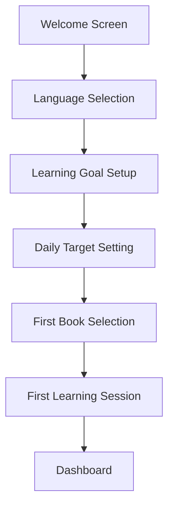
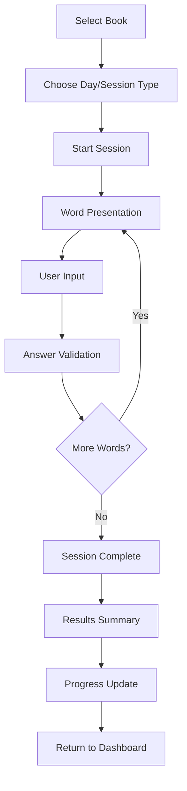
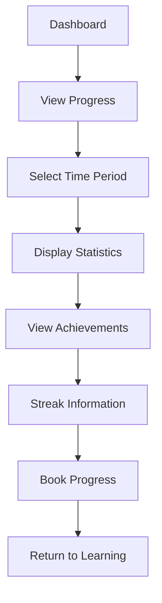

# LexiK3 Frontend UI/UX Requirements

## 📋 Table of Contents

- [Design System Overview](#design-system-overview)
- [Component Library](#component-library)
- [Responsive Design](#responsive-design)
- [Accessibility Requirements](#accessibility-requirements)
- [User Experience Flows](#user-experience-flows)
- [Performance Requirements](#performance-requirements)
- [Animation and Interactions](#animation-and-interactions)
- [Theme and Branding](#theme-and-branding)

## 🎨 Design System Overview

### Design Principles
- **Clarity**: Clear, intuitive interface that guides users through learning
- **Consistency**: Uniform design patterns across all components
- **Accessibility**: WCAG 2.1 AA compliance for inclusive design
- **Performance**: Fast, responsive interactions
- **Engagement**: Motivating visual feedback and progress indicators

### Color Palette

```css
:root {
  /* Primary Colors - Learning Blue */
  --primary-50: #eff6ff;
  --primary-100: #dbeafe;
  --primary-200: #bfdbfe;
  --primary-300: #93c5fd;
  --primary-400: #60a5fa;
  --primary-500: #3b82f6;
  --primary-600: #2563eb;
  --primary-700: #1d4ed8;
  --primary-800: #1e40af;
  --primary-900: #1e3a8a;

  /* Success Colors - Learning Green */
  --success-50: #f0fdf4;
  --success-100: #dcfce7;
  --success-200: #bbf7d0;
  --success-300: #86efac;
  --success-400: #4ade80;
  --success-500: #22c55e;
  --success-600: #16a34a;
  --success-700: #15803d;
  --success-800: #166534;
  --success-900: #14532d;

  /* Warning Colors - Attention Orange */
  --warning-50: #fffbeb;
  --warning-100: #fef3c7;
  --warning-200: #fde68a;
  --warning-300: #fcd34d;
  --warning-400: #fbbf24;
  --warning-500: #f59e0b;
  --warning-600: #d97706;
  --warning-700: #b45309;
  --warning-800: #92400e;
  --warning-900: #78350f;

  /* Error Colors - Alert Red */
  --error-50: #fef2f2;
  --error-100: #fee2e2;
  --error-200: #fecaca;
  --error-300: #fca5a5;
  --error-400: #f87171;
  --error-500: #ef4444;
  --error-600: #dc2626;
  --error-700: #b91c1c;
  --error-800: #991b1b;
  --error-900: #7f1d1d;

  /* Neutral Colors */
  --gray-50: #f9fafb;
  --gray-100: #f3f4f6;
  --gray-200: #e5e7eb;
  --gray-300: #d1d5db;
  --gray-400: #9ca3af;
  --gray-500: #6b7280;
  --gray-600: #4b5563;
  --gray-700: #374151;
  --gray-800: #1f2937;
  --gray-900: #111827;

  /* Semantic Colors */
  --text-primary: var(--gray-900);
  --text-secondary: var(--gray-600);
  --text-tertiary: var(--gray-500);
  --background-primary: #ffffff;
  --background-secondary: var(--gray-50);
  --border-color: var(--gray-200);
  --shadow-sm: 0 1px 2px 0 rgb(0 0 0 / 0.05);
  --shadow-md: 0 4px 6px -1px rgb(0 0 0 / 0.1);
  --shadow-lg: 0 10px 15px -3px rgb(0 0 0 / 0.1);
}
```

### Typography Scale

```css
/* Font Families */
--font-primary: 'Inter', -apple-system, BlinkMacSystemFont, 'Segoe UI', sans-serif;
--font-mono: 'JetBrains Mono', 'Fira Code', monospace;

/* Font Sizes */
--text-xs: 0.75rem;    /* 12px */
--text-sm: 0.875rem;   /* 14px */
--text-base: 1rem;     /* 16px */
--text-lg: 1.125rem;   /* 18px */
--text-xl: 1.25rem;    /* 20px */
--text-2xl: 1.5rem;    /* 24px */
--text-3xl: 1.875rem;  /* 30px */
--text-4xl: 2.25rem;   /* 36px */
--text-5xl: 3rem;      /* 48px */

/* Font Weights */
--font-light: 300;
--font-normal: 400;
--font-medium: 500;
--font-semibold: 600;
--font-bold: 700;
--font-extrabold: 800;

/* Line Heights */
--leading-tight: 1.25;
--leading-snug: 1.375;
--leading-normal: 1.5;
--leading-relaxed: 1.625;
--leading-loose: 2;
```

### Spacing System

```css
/* Spacing Scale (8px base) */
--space-0: 0;
--space-1: 0.25rem;   /* 4px */
--space-2: 0.5rem;    /* 8px */
--space-3: 0.75rem;   /* 12px */
--space-4: 1rem;      /* 16px */
--space-5: 1.25rem;   /* 20px */
--space-6: 1.5rem;    /* 24px */
--space-8: 2rem;      /* 32px */
--space-10: 2.5rem;   /* 40px */
--space-12: 3rem;     /* 48px */
--space-16: 4rem;     /* 64px */
--space-20: 5rem;     /* 80px */
--space-24: 6rem;     /* 96px */
--space-32: 8rem;     /* 128px */
```

## 🧩 Component Library

### Core Components

#### 1. Button Component

```typescript
// components/common/Button.tsx
interface ButtonProps {
  variant: 'primary' | 'secondary' | 'outline' | 'ghost' | 'danger';
  size: 'sm' | 'md' | 'lg';
  disabled?: boolean;
  loading?: boolean;
  icon?: React.ReactNode;
  children: React.ReactNode;
  onClick?: () => void;
  type?: 'button' | 'submit' | 'reset';
  className?: string;
}

const Button: React.FC<ButtonProps> = ({
  variant = 'primary',
  size = 'md',
  disabled = false,
  loading = false,
  icon,
  children,
  onClick,
  type = 'button',
  className = '',
}) => {
  const baseClasses = 'inline-flex items-center justify-center font-medium rounded-lg transition-colors focus:outline-none focus:ring-2 focus:ring-offset-2 disabled:opacity-50 disabled:cursor-not-allowed';
  
  const variantClasses = {
    primary: 'bg-primary-600 text-white hover:bg-primary-700 focus:ring-primary-500',
    secondary: 'bg-gray-600 text-white hover:bg-gray-700 focus:ring-gray-500',
    outline: 'border border-gray-300 bg-white text-gray-700 hover:bg-gray-50 focus:ring-primary-500',
    ghost: 'text-gray-700 hover:bg-gray-100 focus:ring-gray-500',
    danger: 'bg-error-600 text-white hover:bg-error-700 focus:ring-error-500',
  };
  
  const sizeClasses = {
    sm: 'px-3 py-1.5 text-sm',
    md: 'px-4 py-2 text-base',
    lg: 'px-6 py-3 text-lg',
  };
  
  return (
    <button
      type={type}
      disabled={disabled || loading}
      onClick={onClick}
      className={`${baseClasses} ${variantClasses[variant]} ${sizeClasses[size]} ${className}`}
    >
      {loading && <Spinner size="sm" className="mr-2" />}
      {icon && !loading && <span className="mr-2">{icon}</span>}
      {children}
    </button>
  );
};
```

#### 2. Input Component

```typescript
// components/common/Input.tsx
interface InputProps {
  type?: 'text' | 'email' | 'password' | 'number' | 'tel' | 'url';
  label?: string;
  placeholder?: string;
  value: string;
  onChange: (value: string) => void;
  error?: string;
  disabled?: boolean;
  required?: boolean;
  icon?: React.ReactNode;
  className?: string;
}

const Input: React.FC<InputProps> = ({
  type = 'text',
  label,
  placeholder,
  value,
  onChange,
  error,
  disabled = false,
  required = false,
  icon,
  className = '',
}) => {
  const inputId = useId();
  
  return (
    <div className={`space-y-1 ${className}`}>
      {label && (
        <label htmlFor={inputId} className="block text-sm font-medium text-gray-700">
          {label}
          {required && <span className="text-error-500 ml-1">*</span>}
        </label>
      )}
      
      <div className="relative">
        {icon && (
          <div className="absolute inset-y-0 left-0 pl-3 flex items-center pointer-events-none">
            <span className="text-gray-400">{icon}</span>
          </div>
        )}
        
        <input
          id={inputId}
          type={type}
          value={value}
          onChange={(e) => onChange(e.target.value)}
          placeholder={placeholder}
          disabled={disabled}
          required={required}
          className={`
            block w-full px-3 py-2 border rounded-lg shadow-sm placeholder-gray-400
            focus:outline-none focus:ring-2 focus:ring-primary-500 focus:border-primary-500
            disabled:bg-gray-50 disabled:text-gray-500 disabled:cursor-not-allowed
            ${error ? 'border-error-300 focus:ring-error-500 focus:border-error-500' : 'border-gray-300'}
            ${icon ? 'pl-10' : ''}
          `}
        />
      </div>
      
      {error && (
        <p className="text-sm text-error-600">{error}</p>
      )}
    </div>
  );
};
```

#### 3. Card Component

```typescript
// components/common/Card.tsx
interface CardProps {
  children: React.ReactNode;
  variant?: 'default' | 'elevated' | 'outlined';
  padding?: 'none' | 'sm' | 'md' | 'lg';
  className?: string;
  onClick?: () => void;
}

const Card: React.FC<CardProps> = ({
  children,
  variant = 'default',
  padding = 'md',
  className = '',
  onClick,
}) => {
  const baseClasses = 'rounded-lg transition-shadow';
  
  const variantClasses = {
    default: 'bg-white border border-gray-200',
    elevated: 'bg-white shadow-md hover:shadow-lg',
    outlined: 'bg-white border-2 border-gray-200',
  };
  
  const paddingClasses = {
    none: '',
    sm: 'p-4',
    md: 'p-6',
    lg: 'p-8',
  };
  
  const interactiveClasses = onClick ? 'cursor-pointer hover:shadow-md' : '';
  
  return (
    <div
      className={`${baseClasses} ${variantClasses[variant]} ${paddingClasses[padding]} ${interactiveClasses} ${className}`}
      onClick={onClick}
    >
      {children}
    </div>
  );
};
```

### Learning-Specific Components

#### 1. Word Card Component

```typescript
// components/learning/WordCard.tsx
interface WordCardProps {
  word: Word;
  showDefinition?: boolean;
  showExamples?: boolean;
  showPronunciation?: boolean;
  onAnswer?: (answer: string) => void;
  isAnswered?: boolean;
  isCorrect?: boolean;
  className?: string;
}

const WordCard: React.FC<WordCardProps> = ({
  word,
  showDefinition = false,
  showExamples = false,
  showPronunciation = true,
  onAnswer,
  isAnswered = false,
  isCorrect = false,
  className = '',
}) => {
  const [userAnswer, setUserAnswer] = useState('');
  
  const handleSubmit = () => {
    if (onAnswer && userAnswer.trim()) {
      onAnswer(userAnswer.trim());
    }
  };
  
  return (
    <Card className={`learning-word-card ${className}`}>
      <div className="text-center space-y-6">
        {/* Word Term */}
        <div className="space-y-2">
          <h2 className="text-3xl font-bold text-gray-900">{word.term}</h2>
          {showPronunciation && word.pronunciation && (
            <p className="text-lg text-gray-600 font-mono">{word.pronunciation}</p>
          )}
          {word.partOfSpeech && (
            <span className="inline-block px-2 py-1 text-xs font-medium bg-primary-100 text-primary-800 rounded">
              {word.partOfSpeech}
            </span>
          )}
        </div>
        
        {/* Definition (shown after answer or if revealed) */}
        {(showDefinition || isAnswered) && (
          <div className="space-y-3">
            <p className="text-lg text-gray-700">{word.definition}</p>
            
            {showExamples && word.examples.length > 0 && (
              <div className="space-y-2">
                <h4 className="text-sm font-medium text-gray-500 uppercase tracking-wide">Examples</h4>
                <ul className="space-y-1">
                  {word.examples.map((example, index) => (
                    <li key={index} className="text-sm text-gray-600 italic">
                      "{example}"
                    </li>
                  ))}
                </ul>
              </div>
            )}
            
            {word.synonyms.length > 0 && (
              <div className="space-y-2">
                <h4 className="text-sm font-medium text-gray-500 uppercase tracking-wide">Synonyms</h4>
                <div className="flex flex-wrap gap-2">
                  {word.synonyms.map((synonym, index) => (
                    <span key={index} className="px-2 py-1 text-xs bg-gray-100 text-gray-700 rounded">
                      {synonym}
                    </span>
                  ))}
                </div>
              </div>
            )}
          </div>
        )}
        
        {/* Answer Input */}
        {!isAnswered && onAnswer && (
          <div className="space-y-4">
            <Input
              type="text"
              placeholder="Type your answer here..."
              value={userAnswer}
              onChange={setUserAnswer}
              onKeyPress={(e) => e.key === 'Enter' && handleSubmit()}
              className="text-center text-lg"
            />
            <Button onClick={handleSubmit} disabled={!userAnswer.trim()}>
              Submit Answer
            </Button>
          </div>
        )}
        
        {/* Answer Feedback */}
        {isAnswered && (
          <div className={`p-4 rounded-lg ${isCorrect ? 'bg-success-50 border border-success-200' : 'bg-error-50 border border-error-200'}`}>
            <div className="flex items-center space-x-2">
              <span className={`text-2xl ${isCorrect ? 'text-success-600' : 'text-error-600'}`}>
                {isCorrect ? '✓' : '✗'}
              </span>
              <span className={`font-medium ${isCorrect ? 'text-success-800' : 'text-error-800'}`}>
                {isCorrect ? 'Correct!' : 'Incorrect'}
              </span>
            </div>
          </div>
        )}
      </div>
    </Card>
  );
};
```

#### 2. Progress Bar Component

```typescript
// components/learning/ProgressBar.tsx
interface ProgressBarProps {
  current: number;
  total: number;
  showPercentage?: boolean;
  showNumbers?: boolean;
  size?: 'sm' | 'md' | 'lg';
  className?: string;
}

const ProgressBar: React.FC<ProgressBarProps> = ({
  current,
  total,
  showPercentage = true,
  showNumbers = true,
  size = 'md',
  className = '',
}) => {
  const percentage = total > 0 ? (current / total) * 100 : 0;
  
  const sizeClasses = {
    sm: 'h-2',
    md: 'h-3',
    lg: 'h-4',
  };
  
  return (
    <div className={`space-y-2 ${className}`}>
      <div className="flex justify-between items-center">
        {showNumbers && (
          <span className="text-sm font-medium text-gray-700">
            {current} / {total}
          </span>
        )}
        {showPercentage && (
          <span className="text-sm font-medium text-gray-500">
            {Math.round(percentage)}%
          </span>
        )}
      </div>
      
      <div className={`w-full bg-gray-200 rounded-full overflow-hidden ${sizeClasses[size]}`}>
        <div
          className="h-full bg-gradient-to-r from-primary-500 to-primary-600 rounded-full transition-all duration-300 ease-out"
          style={{ width: `${percentage}%` }}
        />
      </div>
    </div>
  );
};
```

#### 3. Streak Counter Component

```typescript
// components/progress/StreakCounter.tsx
interface StreakCounterProps {
  currentStreak: number;
  longestStreak?: number;
  size?: 'sm' | 'md' | 'lg';
  showAnimation?: boolean;
  className?: string;
}

const StreakCounter: React.FC<StreakCounterProps> = ({
  currentStreak,
  longestStreak,
  size = 'md',
  showAnimation = true,
  className = '',
}) => {
  const [isAnimating, setIsAnimating] = useState(false);
  
  useEffect(() => {
    if (showAnimation && currentStreak > 0) {
      setIsAnimating(true);
      const timer = setTimeout(() => setIsAnimating(false), 1000);
      return () => clearTimeout(timer);
    }
  }, [currentStreak, showAnimation]);
  
  const sizeClasses = {
    sm: 'text-lg',
    md: 'text-2xl',
    lg: 'text-4xl',
  };
  
  return (
    <div className={`flex items-center space-x-2 ${className}`}>
      <div className={`relative ${isAnimating ? 'animate-pulse' : ''}`}>
        <span className={`${sizeClasses[size]} text-warning-500`}>🔥</span>
        {isAnimating && (
          <div className="absolute inset-0 animate-ping">
            <span className={`${sizeClasses[size]} text-warning-400`}>🔥</span>
          </div>
        )}
      </div>
      
      <div className="space-y-1">
        <div className="flex items-baseline space-x-2">
          <span className={`font-bold text-gray-900 ${sizeClasses[size]}`}>
            {currentStreak}
          </span>
          <span className="text-sm text-gray-500">day streak</span>
        </div>
        
        {longestStreak && longestStreak > currentStreak && (
          <div className="text-xs text-gray-400">
            Best: {longestStreak} days
          </div>
        )}
      </div>
    </div>
  );
};
```

## 📱 Responsive Design

### Breakpoint System

```css
/* Breakpoints */
--breakpoint-sm: 640px;   /* Small devices */
--breakpoint-md: 768px;   /* Medium devices */
--breakpoint-lg: 1024px;  /* Large devices */
--breakpoint-xl: 1280px;  /* Extra large devices */
--breakpoint-2xl: 1536px; /* 2X large devices */

/* Media Queries */
@media (min-width: 640px) { /* sm */ }
@media (min-width: 768px) { /* md */ }
@media (min-width: 1024px) { /* lg */ }
@media (min-width: 1280px) { /* xl */ }
@media (min-width: 1536px) { /* 2xl */ }
```

### Mobile-First Approach

```typescript
// components/layout/ResponsiveLayout.tsx
const ResponsiveLayout: React.FC<{ children: React.ReactNode }> = ({ children }) => {
  return (
    <div className="min-h-screen bg-gray-50">
      {/* Mobile Header */}
      <header className="lg:hidden bg-white shadow-sm border-b border-gray-200">
        <div className="px-4 py-3 flex items-center justify-between">
          <h1 className="text-lg font-semibold text-gray-900">LexiK3</h1>
          <button className="p-2 text-gray-600 hover:text-gray-900">
            <MenuIcon className="w-6 h-6" />
          </button>
        </div>
      </header>
      
      {/* Desktop Sidebar */}
      <div className="hidden lg:flex lg:flex-col lg:fixed lg:inset-y-0 lg:w-64 lg:bg-white lg:border-r lg:border-gray-200">
        <Sidebar />
      </div>
      
      {/* Main Content */}
      <main className="lg:pl-64">
        <div className="px-4 py-6 sm:px-6 lg:px-8">
          {children}
        </div>
      </main>
    </div>
  );
};
```

### Touch-Friendly Design

```css
/* Touch targets minimum 44px */
.touch-target {
  min-height: 44px;
  min-width: 44px;
}

/* Swipe gestures */
.swipeable {
  touch-action: pan-x;
  user-select: none;
}

/* Mobile-optimized inputs */
.mobile-input {
  font-size: 16px; /* Prevents zoom on iOS */
  padding: 12px 16px;
  border-radius: 8px;
}
```

## ♿ Accessibility Requirements

### WCAG 2.1 AA Compliance

#### Color Contrast
- **Normal text**: 4.5:1 contrast ratio minimum
- **Large text**: 3:1 contrast ratio minimum
- **UI components**: 3:1 contrast ratio minimum

#### Keyboard Navigation
```typescript
// components/common/KeyboardNavigation.tsx
const useKeyboardNavigation = () => {
  useEffect(() => {
    const handleKeyDown = (event: KeyboardEvent) => {
      switch (event.key) {
        case 'Tab':
          // Ensure proper tab order
          break;
        case 'Enter':
        case ' ':
          // Activate focused element
          break;
        case 'Escape':
          // Close modals, cancel actions
          break;
        case 'ArrowUp':
        case 'ArrowDown':
          // Navigate lists, menus
          break;
      }
    };
    
    document.addEventListener('keydown', handleKeyDown);
    return () => document.removeEventListener('keydown', handleKeyDown);
  }, []);
};
```

#### Screen Reader Support
```typescript
// components/common/AccessibleButton.tsx
const AccessibleButton: React.FC<ButtonProps> = ({ children, ...props }) => {
  return (
    <button
      {...props}
      aria-label={props['aria-label'] || children?.toString()}
      role="button"
      tabIndex={0}
    >
      {children}
    </button>
  );
};
```

#### Focus Management
```typescript
// hooks/useFocusManagement.ts
export const useFocusManagement = () => {
  const focusRef = useRef<HTMLElement>(null);
  
  const trapFocus = (element: HTMLElement) => {
    const focusableElements = element.querySelectorAll(
      'button, [href], input, select, textarea, [tabindex]:not([tabindex="-1"])'
    );
    
    const firstElement = focusableElements[0] as HTMLElement;
    const lastElement = focusableElements[focusableElements.length - 1] as HTMLElement;
    
    const handleTabKey = (e: KeyboardEvent) => {
      if (e.key === 'Tab') {
        if (e.shiftKey) {
          if (document.activeElement === firstElement) {
            lastElement.focus();
            e.preventDefault();
          }
        } else {
          if (document.activeElement === lastElement) {
            firstElement.focus();
            e.preventDefault();
          }
        }
      }
    };
    
    element.addEventListener('keydown', handleTabKey);
    firstElement?.focus();
    
    return () => element.removeEventListener('keydown', handleTabKey);
  };
  
  return { focusRef, trapFocus };
};
```

## 🎯 User Experience Flows

### 1. Onboarding Flow



### 2. Learning Session Flow



### 3. Progress Tracking Flow



## ⚡ Performance Requirements

### Core Web Vitals Targets
- **Largest Contentful Paint (LCP)**: < 2.5s
- **First Input Delay (FID)**: < 100ms
- **Cumulative Layout Shift (CLS)**: < 0.1

### Performance Optimizations

#### Code Splitting
```typescript
// Lazy load components
const LearningSession = lazy(() => import('./components/learning/LearningSession'));
const ProgressDashboard = lazy(() => import('./components/progress/ProgressDashboard'));

// Route-based splitting
const App = () => {
  return (
    <Router>
      <Suspense fallback={<LoadingSpinner />}>
        <Routes>
          <Route path="/learn" element={<LearningSession />} />
          <Route path="/progress" element={<ProgressDashboard />} />
        </Routes>
      </Suspense>
    </Router>
  );
};
```

#### Image Optimization
```typescript
// components/common/OptimizedImage.tsx
const OptimizedImage: React.FC<{
  src: string;
  alt: string;
  width?: number;
  height?: number;
  className?: string;
}> = ({ src, alt, width, height, className }) => {
  return (
    
  );
};
```

#### Memoization
```typescript
// Memoized components
const WordCard = memo<WordCardProps>(({ word, onAnswer, ...props }) => {
  const handleAnswer = useCallback((answer: string) => {
    onAnswer?.(answer);
  }, [onAnswer]);
  
  return (
    <div className="word-card">
      {/* Component content */}
    </div>
  );
});
```

## 🎭 Animation and Interactions

### Animation Principles
- **Purposeful**: Animations should enhance UX, not distract
- **Performance**: Use CSS transforms and opacity for smooth animations
- **Accessibility**: Respect `prefers-reduced-motion` setting
- **Consistent**: Use consistent timing and easing functions

### Animation System

```css
/* Animation Variables */
:root {
  --duration-fast: 150ms;
  --duration-normal: 300ms;
  --duration-slow: 500ms;
  --ease-in: cubic-bezier(0.4, 0, 1, 1);
  --ease-out: cubic-bezier(0, 0, 0.2, 1);
  --ease-in-out: cubic-bezier(0.4, 0, 0.2, 1);
}

/* Fade Animations */
@keyframes fadeIn {
  from { opacity: 0; }
  to { opacity: 1; }
}

@keyframes fadeOut {
  from { opacity: 1; }
  to { opacity: 0; }
}

/* Slide Animations */
@keyframes slideInUp {
  from { transform: translateY(100%); }
  to { transform: translateY(0); }
}

@keyframes slideInDown {
  from { transform: translateY(-100%); }
  to { transform: translateY(0); }
}

/* Scale Animations */
@keyframes scaleIn {
  from { transform: scale(0.9); opacity: 0; }
  to { transform: scale(1); opacity: 1; }
}

/* Utility Classes */
.animate-fade-in {
  animation: fadeIn var(--duration-normal) var(--ease-out);
}

.animate-slide-up {
  animation: slideInUp var(--duration-normal) var(--ease-out);
}

.animate-scale-in {
  animation: scaleIn var(--duration-fast) var(--ease-out);
}

/* Respect user preferences */
@media (prefers-reduced-motion: reduce) {
  * {
    animation-duration: 0.01ms !important;
    animation-iteration-count: 1 !important;
    transition-duration: 0.01ms !important;
  }
}
```

### Interactive Feedback

```typescript
// components/common/InteractiveButton.tsx
const InteractiveButton: React.FC<ButtonProps> = ({ children, onClick, ...props }) => {
  const [isPressed, setIsPressed] = useState(false);
  const [isHovered, setIsHovered] = useState(false);
  
  return (
    <button
      {...props}
      onMouseDown={() => setIsPressed(true)}
      onMouseUp={() => setIsPressed(false)}
      onMouseEnter={() => setIsHovered(true)}
      onMouseLeave={() => setIsHovered(false)}
      onClick={onClick}
      className={`
        transition-all duration-150 ease-out
        ${isPressed ? 'scale-95' : 'scale-100'}
        ${isHovered ? 'shadow-lg' : 'shadow-md'}
      `}
    >
      {children}
    </button>
  );
};
```

## 🎨 Theme and Branding

### Dark Mode Support

```typescript
// contexts/ThemeContext.tsx
interface ThemeContextType {
  theme: 'light' | 'dark';
  toggleTheme: () => void;
}

export const ThemeProvider: React.FC<{ children: React.ReactNode }> = ({ children }) => {
  const [theme, setTheme] = useState<'light' | 'dark'>('light');
  
  const toggleTheme = () => {
    setTheme(prev => prev === 'light' ? 'dark' : 'light');
  };
  
  useEffect(() => {
    document.documentElement.setAttribute('data-theme', theme);
  }, [theme]);
  
  return (
    <ThemeContext.Provider value={{ theme, toggleTheme }}>
      {children}
    </ThemeContext.Provider>
  );
};
```

### Brand Guidelines

#### Logo Usage
- **Primary Logo**: Use on main headers and splash screens
- **Icon Logo**: Use in favicons and small spaces
- **Minimum Size**: 24px height for icon, 120px width for full logo
- **Clear Space**: Equal to the height of the "L" in LexiK3

#### Typography Hierarchy
```css
/* Headings */
.heading-1 { font-size: 2.25rem; font-weight: 700; line-height: 1.2; }
.heading-2 { font-size: 1.875rem; font-weight: 600; line-height: 1.3; }
.heading-3 { font-size: 1.5rem; font-weight: 600; line-height: 1.4; }

/* Body Text */
.body-large { font-size: 1.125rem; font-weight: 400; line-height: 1.6; }
.body-medium { font-size: 1rem; font-weight: 400; line-height: 1.5; }
.body-small { font-size: 0.875rem; font-weight: 400; line-height: 1.4; }
```

#### Color Usage Guidelines
- **Primary Blue**: Use for main actions, links, and highlights
- **Success Green**: Use for positive feedback and completed states
- **Warning Orange**: Use for attention-grabbing elements and streaks
- **Error Red**: Use sparingly for errors and destructive actions
- **Neutral Grays**: Use for text, borders, and subtle backgrounds

---

**Last Updated**: January 2025  
**Version**: 1.0.0  
**Status**: Ready for Implementation ✅
